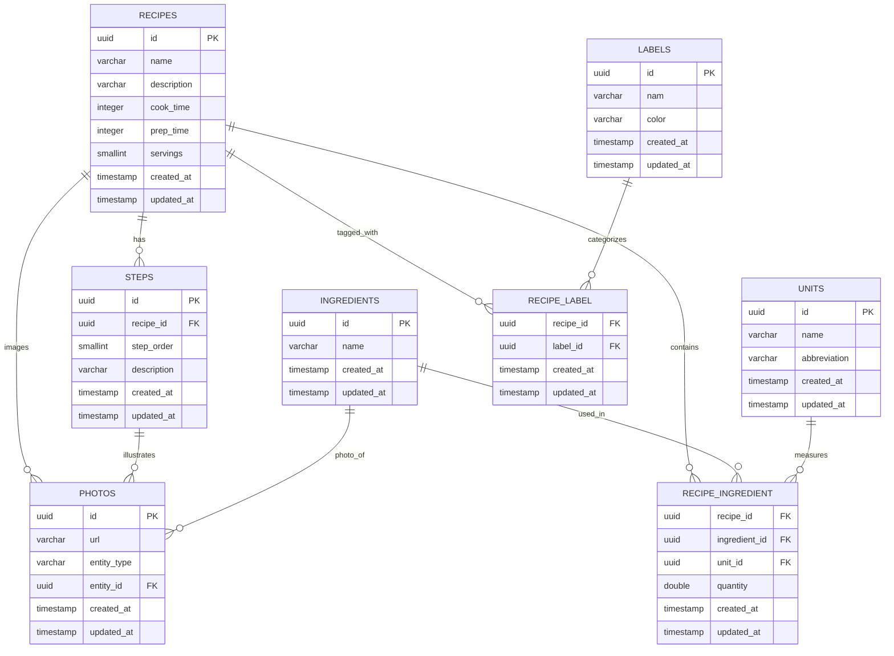

```mermaid
erDiagram
    RECIPES {
        uuid id PK
        varchar name
        varchar description
        integer cook_time
        integer prep_time
        smallint servings
        timestamp created_at
        timestamp updated_at
    }

    INGREDIENTS {
        uuid id PK
        varchar name
        timestamp created_at
        timestamp updated_at
    }

    UNITS {
        uuid id PK
        varchar name
        varchar abbreviation
        timestamp created_at
        timestamp updated_at
    }

    LABELS {
        uuid id PK
        varchar nam
        varchar color
        timestamp created_at
        timestamp updated_at
    }

    STEPS {
        uuid id PK
        uuid recipe_id FK
        smallint step_order
        varchar description
        timestamp created_at
        timestamp updated_at
    }

    RECIPE_INGREDIENT {
        uuid recipe_id FK
        uuid ingredient_id FK
        uuid unit_id FK
        double quantity
        timestamp created_at
        timestamp updated_at
    }

    RECIPE_LABEL {
        uuid recipe_id FK
        uuid label_id FK
        timestamp created_at
        timestamp updated_at
    }

    PHOTOS {
        uuid id PK
        varchar url
        varchar entity_type
        uuid entity_id FK
        timestamp created_at
        timestamp updated_at
    }

    RECIPES ||--o{ STEPS : has
    RECIPES ||--o{ RECIPE_INGREDIENT : contains
    RECIPES ||--o{ RECIPE_LABEL : tagged_with
    RECIPES ||--o{ PHOTOS : images
    INGREDIENTS ||--o{ RECIPE_INGREDIENT : used_in
    UNITS ||--o{ RECIPE_INGREDIENT : measures
    LABELS ||--o{ RECIPE_LABEL : categorizes
    STEPS ||--o{ PHOTOS : illustrates
    INGREDIENTS ||--o{ PHOTOS : photo_of

```