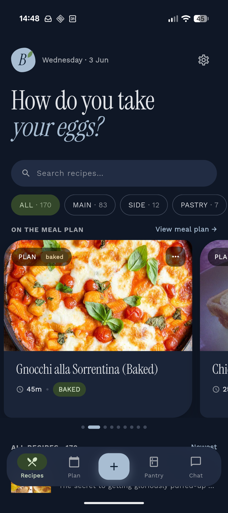
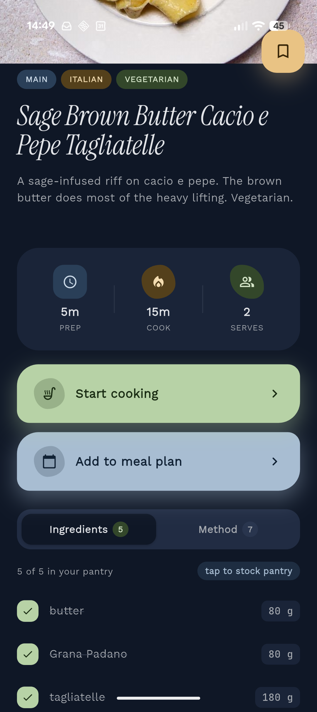
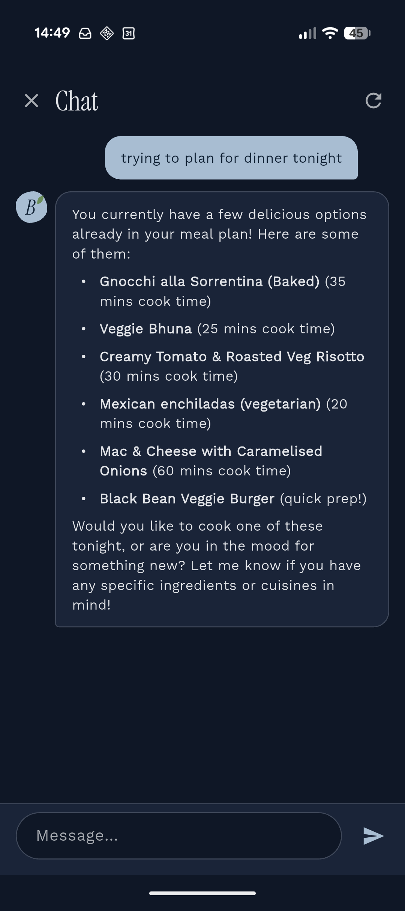

# The Bluer Book

A personal recipe book — named after the little blue book we keep recipes in at home.

It's a Go backend with a Flutter app, and it's a bit unusual: alongside the normal REST
API the app talks to, it ships an **MCP server** so Claude (or any LLM assistant) can
search, write, and tidy up recipes for you. There's also a built-in chat assistant that
uses those same tools.

## 📱 Screenshots

<table>
  <tr>
    <td align="center"></td>
    <td align="center"></td>
    <td align="center"></td>
  </tr>
  <tr>
    <td align="center">Home &amp; meal plan</td>
    <td align="center">Recipe detail</td>
    <td align="center">Chat assistant</td>
  </tr>
</table>

## 🍳 What you can do

- Keep recipes — ingredients (with quantities, units, prep notes and components like
  "sauce" or "filling"), ordered steps, photos, cook/prep times and servings.
- Tag recipes with a small typed taxonomy (course / cuisine / diet / method) and filter
  by it.
- Plan meals — star recipes onto a meal plan.
- Cook hands-free — a cooking mode that keeps the screen awake and supports touchless
  gestures.
- Archive recipes (soft delete) and restore them later.
- Ask an assistant — chat to find or create recipes, or point Claude at the MCP server
  and let it manage the book directly.

## 🔧 How it's built

| Layer        | Tech                                                            |
|--------------|-----------------------------------------------------------------|
| Backend      | Go — REST API + MCP server in one binary, layered DDD           |
| Database     | PostgreSQL, with [sqlc](https://sqlc.dev) for type-safe queries |
| LLM chat     | Google ADK + Gemini, streamed over SSE                          |
| Mobile/web   | Flutter (Riverpod, Dio, freezed) in `app/`                      |
| Infra        | Docker, Helm charts, Prometheus metrics, Ory (Hydra/Oathkeeper) |

## 🚀 Running it locally

You'll need Go, Docker, and (for the app) Flutter.

### 1. Database + backend with Docker Compose

```bash
cp .env.example .env            # set DB_PASS to something
docker volume create the-bluer-book-db
docker compose --profile app up --build
```

This starts Postgres, runs migrations, and serves the API on
[http://localhost:8080](http://localhost:8080).

### Or: run just Postgres and the binary directly

```bash
cp .env.example .env
docker compose up -d db                    # Postgres only

go run . migrate                           # apply migrations (reads DB_* env vars)
go run . server                            # REST :8080, MCP :8082
```

> **Heads up:** the SQL access layer (`internal/infrastructure/storage/db/`) is generated
> by sqlc and isn't checked in. In a fresh clone, run `sqlc generate` before building.

To use the chat assistant, set `GOOGLE_API_KEY` (a Google AI Studio key) in your
environment.

### 2. The Flutter app

```bash
cd app
flutter pub get
dart run build_runner build --delete-conflicting-outputs   # generate model code
flutter run --dart-define=API_URL=http://localhost:8080
```

Product analytics (PostHog) are **off by default** — they only switch on when you pass a
key at build time:

```bash
flutter run \
  --dart-define=API_URL=http://localhost:8080 \
  --dart-define=POSTHOG_API_KEY=phc_xxx \
  --dart-define=POSTHOG_HOST=https://eu.i.posthog.com   # optional; EU is the default
```

## 📁 Project layout

```
.                  Go backend (cmd/, internal/, migrations/)
app/               Flutter app
charts/            Helm charts
docs/              architecture & contributor docs
```

## 🤝 Contributing / working on it

- High-level design: [`docs/architecture.md`](docs/architecture.md)
- Backend conventions: [`docs/backend.md`](docs/backend.md)
- Frontend conventions: [`docs/frontend.md`](docs/frontend.md)
- If you (or an AI agent) are making changes, start with [`AGENTS.md`](AGENTS.md) — it
  captures the non-obvious rules and points at the deep dives.

## 🗺️ Roadmap

LLM-powered semantic search · shopping lists · photo uploads · richer meal planning ·
voice-driven interactions.
